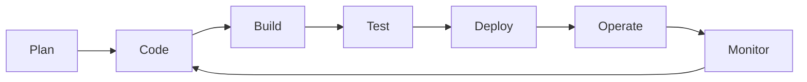

# Hello There 👋

```yaml
apiVersion: v39
kind: Human
metadata:
  name: Marcelo Guerrero
spec:
  purpose: DevOps and Cloud Computing
  sponsorship: my wife.
  locations:   
    - 
      type: Homepage
      where: [https://portfolio.slopeit.com]
    - 
      type: Own-Company
      where: [https://www.slopeit.com]
    
  favorites:
    number: 17
    animal: 🐶
    sport: running
    food: 🥩
```

```terraform
provider "slopeit" {}

resource "croguerrero_instance" "vm" {
  ami           = "ami-b6e499ce"
  instance_type = "T-800"
  
module "tools" {
  tags = {
    CloudProviders = "AWS - GCP "
    IaaC           = "Terraform, Ansible"
    Workflows      = "GitActions, Gitlab, GitOps"
    Containers     = "Docker , Kubernetes"
    S.O            = "Debian, CentOS, WindowsServer"
    Languajes      = "Python , Bash"
    Networking     = "Cisco, HP, Ubiquiti, Fortinet, VMware"
     
  }
module "certifications"
    {
      GCP Devops Profesional
      GCP Security Profesional
      GCP Associate 
    }

```

```bash
#!/bin/bash
Deploy your own infrastructure as simple as you want !!!!
```
[](https://twitter.com/croguerrero)
[](https://www.linkedin.com/in/marcelo-guerrero-760413125/)
