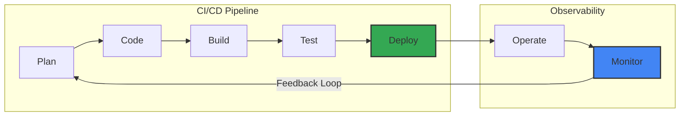

### Hello There 👋 I'm Christian

```yaml
apiVersion: v1
kind: DevOpsEngineer
metadata:
  name: Marcelo "Christian" Guerrero
  role: Cloud & DevSecOps
spec:
  focus:
    - Google Cloud Platform (GCP)
    - AWS
    - MLOps & Automation
    - Algorithmic Trading (Gold/Nasdaq)
  sponsorship: My Wife & Son 👶
  locations:
    - type: Portfolio
      url: "https://portfolio.slopeit.com"
    - type: Company
      url: "https://www.slopeit.com"

  favorites:
    manga: Dragon Ball 🐉
    music: Trance 🎵
    sport: Running 🏃
    food: 🥩

```

```hcl
# Infrastructure as Code - Personal Stack

provider "google" {
  region  = "us-central1"
  project = "slopeit-infrastructure"
}

resource "christian_guerrero" "engineer" {
  ami           = "ami-devops-v2026"
  instance_type = "T-800-High-Performance" # Powered by high-end hardware

  tags = {
    Name           = "Christian Guerrero"
    CloudProviders = "GCP (Expert) | AWS"
    IaaC           = "Terraform, Ansible"
    Containers     = "Docker, Kubernetes"
    CI_CD          = "GitHub Actions, GitLab CI, ArgoCD"
    OS             = "Debian, Windows Server"
    Languages      = "Python, Bash, English (In Progress)"
  }
}

# Active Projects & Goals
module "current_status" {
  source = "./projects"

  objective       = "Financial Freedom"
  active_learning = ["MLOps", "English Proficiency"]

  project "trading_bot" {
    market   = ["NASDAQ", "Gold"]
    strategy = "Swing Trading"
    status   = "In Development 📈"
  }
}

locals {
  certifications = [
    "GCP DevOps Professional",
    "GCP Security Professional",
    "GCP Associate Cloud Engineer"
  ]
}

```

```mermaid
    flowchart LR
    subgraph CI/CD Pipeline
    Plan --> Code
    Code --> Build
    Build --> Test
    Test --> Deploy
    end

    subgraph Observability
    Deploy --> Operate
    Operate --> Monitor
    Monitor -->|Feedback Loop| Plan
    end

    style Deploy fill:#34A853,stroke:#333,stroke-width:2px
    style Monitor fill:#4285F4,stroke:#333,stroke-width:2px
    
    
```

```bash
#!/bin/bash
# Deploy your own infrastructure as simple as you want!

TARGET="Automation"
echo "🚀 Initializing DevOps sequence..."

if [ "$1" == "--contact" ]; then
    echo "Let's build something great together."
fi
```

[](https://www.linkedin.com/in/marcelo-guerrero-760413125/)
